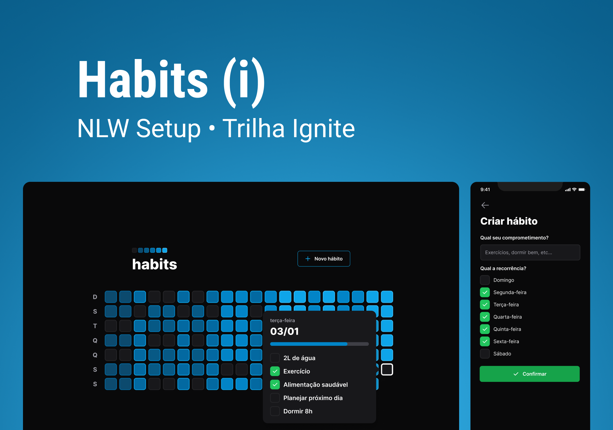

<p align="center">
  
  
  
</p>



<h2 align="center"># Habits - Você no controle do seus hábitos.</h2>

## 🚀 Tecnologias

Esse projeto foi desenvolvido com as seguintes tecnologias:

- [ReactJS](https://reactjs.org/)
- [TailwindCSS](https://tailwindcss.com/)
- [TypeScript](https://www.typescriptlang.org/)
- [ViteJS](https://vitejs.dev/)
- [Prisma](https://www.prisma.io/)
- [Fastify](https://www.fastify.io/)
- [Expo](https://expo.io/)
- [React Native](https://reactnative.dev/)
- [React Navigation](https://reactnavigation.org/)


## 🚀 Iniciando o projeto

Clone o projeto e acesse a pasta.

```bash
$ git clone https://github.com/JefMoreira/NLW-Setup-Habit.git
$ cd nlw-setup-habit
```

Siga os passos abaixo, para instalar os serviços Web, Mobile e Server:

### Server

```bash
# Instalando as dependências dos Server
$ cd server
$ npm install

# Iniciando Server do projeto 
$ npx prisma migrate deploy
$ npm run dev
```

### Web

```bash
# Instalando as dependências Web
$ cd web
$ npm install

# Iniciando o projeto Web
$ npm start
```
### Mobile

```bash
# Instalando as dependências Mobile
$ cd mobile
$ npm install

# Iniciando Server do mobile
$ npm start
```

## 🔖 Layout

Você pode visualizar o layout do projeto através dos links abaixo:

- [Layout](<https://www.figma.com/file/pJpaMSKVfCmPUMZJOVwquQ/Habits-(i)-(Community)?node-id=6%3A344&t=1UcC6dIPVGBxdhpz-1>)

Lembrando que você precisa ter uma conta no [Figma](http://figma.com/) para poder acessar.

---

Projeto desenvolvido com 💜 por [JefMoreira](https://github.com/JefMoreira)
